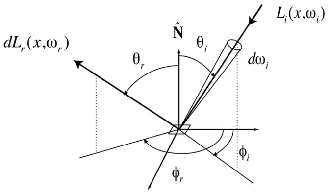
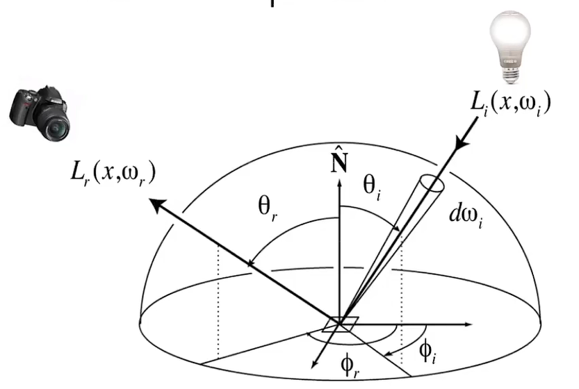
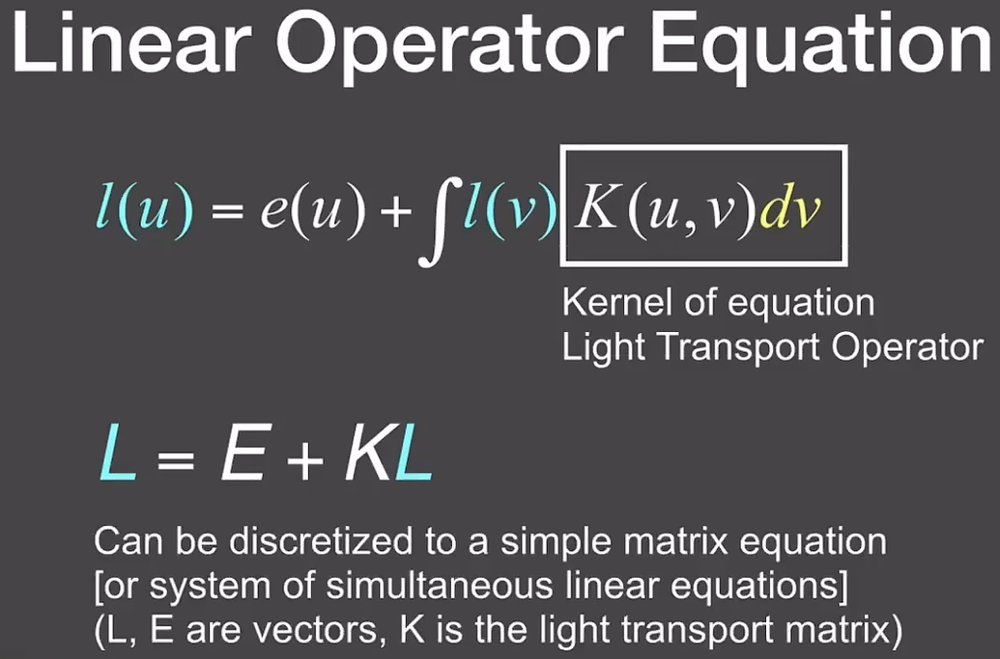
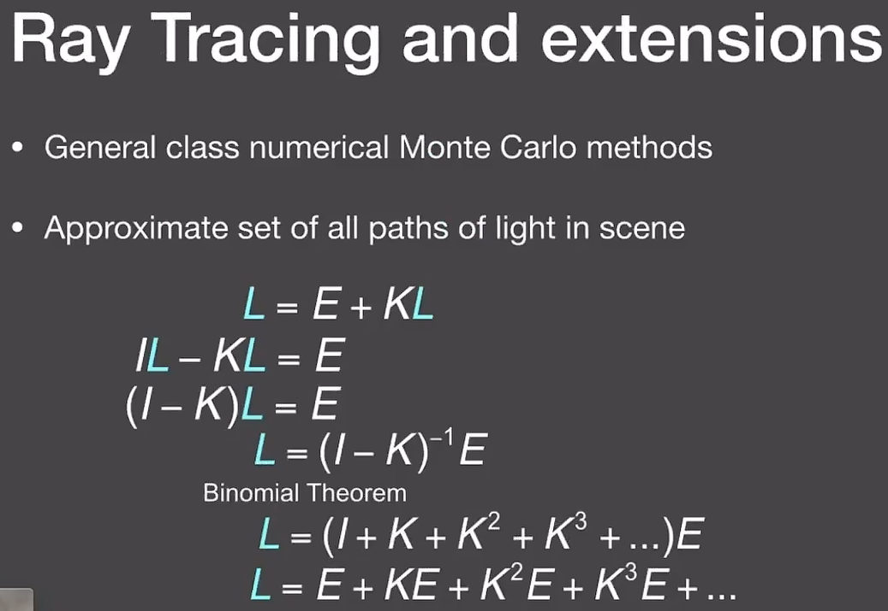
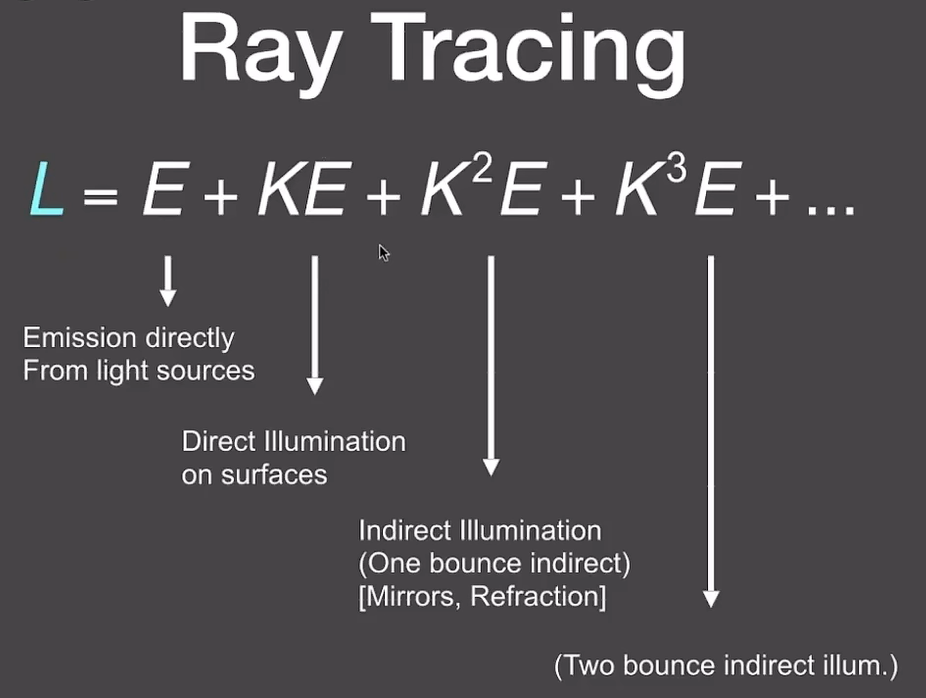
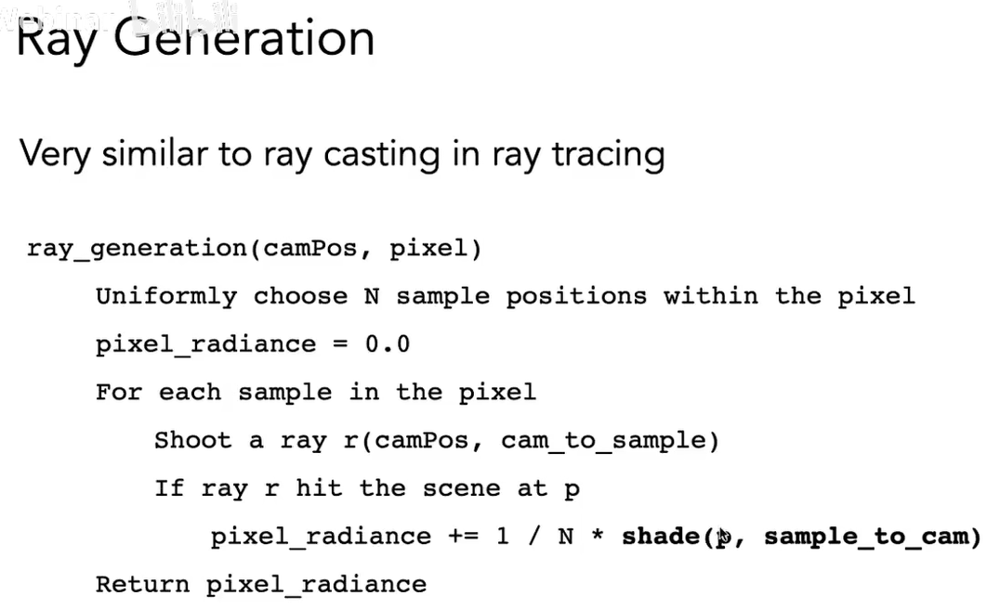

# GAMES101 笔记

## 课程注解

### 旋转变换矩阵是正交矩阵

### 先线性变换再平移

$$
\begin{pmatrix}
a&b&c&t_x\\
d&e&f&t_y\\
g&h&i&t_z\\
0&0&0&1\\
\end{pmatrix}=
\begin{pmatrix}
1&0&0&t_x\\
0&1&0&t_y\\
0&0&1&t_z\\
0&0&0&1\\
\end{pmatrix}\begin{pmatrix}
a&b&c&0\\
d&e&f&0\\
g&h&i&0\\
0&0&0&1\\
\end{pmatrix}
$$

$$
变换=平移变换\times线性变换
$$

### 透视投影

对远端平面上的任意一点，x、y坐标的缩放如下图所示

n为原点与近端平面的距离

因此变换后的齐次坐标为

$$
\begin{pmatrix}
nx/z\\ny/z\\z'\\1
\end{pmatrix}==\begin{pmatrix}
nx\\ny\\zz'\\z
\end{pmatrix}
$$

设变换矩阵的为

$$
\begin{pmatrix}
n&0&0&0\\
0&n&0&0\\
A&B&C&D\\
0&0&1&0\\
\end{pmatrix}
$$

近端平面上任意一点的坐标不变（规定）为n

$$
\begin{pmatrix}
x\\y\\n\\1
\end{pmatrix}==\begin{pmatrix}
nx\\ny\\n^2\\n
\end{pmatrix}
$$

因此

$$
\begin{pmatrix}
A&B&C&D
\end{pmatrix}\begin{pmatrix}
x\\y\\n\\1
\end{pmatrix}=Ax+By+Cn+D=n^2\\
=>A=B=0
$$

远端平面上任意一点的z坐标不变（规定）为f

$$
\begin{pmatrix}
0&0&C&D
\end{pmatrix}\begin{pmatrix}
x\\y\\f\\1
\end{pmatrix}=Cf+D=f^2
$$

联立解得

$$
C=n+f\\
D=-nf
$$

因此透视投影的变换矩阵为

$$
\begin{pmatrix}
n&0&0&0\\
0&n&0&0\\
0&0&n+f&-nf\\
0&0&1&0\\
\end{pmatrix}
$$

对梯形中的任意一点，变换之后的坐标为

$$
\begin{pmatrix}
n&0&0&0\\
0&n&0&0\\
0&0&n+f&-nf\\
0&0&1&0\\
\end{pmatrix}\begin{pmatrix}
x\\y\\z\\1
\end{pmatrix}=\begin{pmatrix}
nx\\ny\\(n+f)z-nf\\z
\end{pmatrix}\\
其中\ f\le z\le n\lt0
$$

计算可知

$$
\frac{(n+f)z-nf}{z}\le z
$$

因此变换之后，梯形体内部的z坐标相比变换前变小了，也即变远了

### 时域上的卷积等于频域上的乘积

傅里叶变换的性质

$$
F[f_1(t)]=F_1(x)\\
F[f_2(t)]=F_2(x)\\
F[f_1*f_2]=F_1\times F_2
$$

### 三维空间中三角形内点的重心坐标，在投影到二维平面上后发生改变

因此对像素做插值时，应该先将像素中心坐标变换回原三角形中的坐标，再求其重心坐标并插值

### 双向反射分布函数（BRDF）

对任意入射光线，在任意反射方向下的反射能量的分布，定义材质的反射性质

$$
f_r(\omega_i\rightarrow\omega_r)=\frac{dL_r(\omega_r)}{dE_i(\omega_i)}=\frac{dL_r(\omega_r)}{L_i(\omega_i)\cos{\theta_i}d\omega_i}
$$

### 反射方程

对所有入射方向做积分（也即对所有入射光线求和）

$$
L_r(p,\omega_r)=\int_{H^2}f_r(p,\omega_i\rightarrow\omega_r)L_i(p,\omega_i)\cos{\theta_i}d\omega_i\\
=\int_{H^2}f_r(p,\omega_i\rightarrow\omega_r)E_i(p,\omega_i)
$$

递归则描述光线多次反射的过程

### 渲染方程

在反射方程中加入自发光项

$$
L_o(p,\omega_o)=L_e(p,\omega_o)+\int_{\Omega^+}L_i(p,\omega_i)f_r(p,\omega_i,\omega_o)(n\cdot\omega_i)d\omega_i
$$

由于光线可以在物体表面间弹射，为了求解全局光照，将渲染方程记作如图形式

对入射光线求反射的过程可以简写为一个算符

即得全局光照方程，其中各项的物理意义即为：光源项、表面反射项、弹射一次的表面反射项、弹射两次的表面反射项等

其中除前两项（直接光照）外，（间接光照）更适合用光线追踪方法完成

### 蒙特卡洛积分

以积分的积分域为定义域取一随机变量$X$，求出其概率密度函数，进行多次采样，然后求平均值

特殊情况：均匀采样

### 从 Whitted-Style 光线追踪到路径追踪

首先，渲染方程没有错误，但其中有两个问题

$$
L_o(p,\omega_o)=L_e(p,\omega_o)+\int_{\Omega^+}L_i(p,\omega_i)f_r(p,\omega_i,\omega_o)(n\cdot\omega_i)d\omega_i
$$

1. 包含积分项
2. 包含递归定义

解决的方法：

1. 蒙特卡洛积分

   
2. 图中蓝色 `Else` 项即为间接光照项。若遇到其他物体，则进行递归

   

新的问题：

1. 随着递归次数增加，光线数量爆炸

   

   若只使用一根光线进行蒙特卡洛积分的采样，则光线数量不会爆炸

   为了使结果有意义，使用更多的光线（路径）对同一个像素采样即可

   

   
2. 新的算法依然是递归，且没有停止条件。若限制光线弹射次数，那么最终结果一定相比实际结果损失能量
   使用“俄罗斯轮盘赌”方法，`p` 的概率返回值为 `Lo/p` ，`1-p` 的概率返回值为 `0` ，如此一来结果的期望依然是 `Lo` ，即期望是实际结果

   

   

### 改进路径追踪效率低下的问题

在上述算法中，蒙特卡洛积分在$2\pi$大小的立体角上随机采样，当光源小、少时效率低下，因此直接对光源采样

更改积分域

因此，对直接光照的计算只需要通过对光源采样，直接计算；而对间接光照，使用“俄罗斯轮盘赌”法，对$2\pi$立体角采样

在对光源采样时，需要从视点发出一根光线，检测和光源之间是否有阻挡

### 什么是材质（Material）

材质是物体与光线作用的方式，因此在物体表面，材质就是物体反射光的方式，就是BRDF

### 漫反射材质

假设入射光在空间中均匀分布，出射光在半球面方向上（$2\pi$立体角上）均匀分布，那么图中$f_r$，$L_i$是常数

若漫反射完全不损耗能量，那么$L_i=L_o$，得到$f_r=\frac{1}{\pi}$。若漫反射存在能量损耗，则$f_r=\frac{\rho}{\pi}$，其中$\rho$是反射率，可定义不同的颜色

### 菲涅尔效应

入射角越大，反射的能量越多

菲涅尔项的准确计算和近似估计

### 微表面模型（Microfacet Material）

远处观察到的是光滑物体表现出的不同的材质，近处观察到的不同的几何形状，材质的不同取决于物体微表面的几何形状

材质的粗糙程度取决于物体微表面的法线分布

其中$D(h)$为微表面法线方向的分布函数，$h$为出射方向和入射方向的half vector

在微表面模型中，只有法线方向和$h$相同的微表面才能将光线从入射方向反射到出射方向

其中$G(i,o,h)$为不同方向的微表面在反射时发生遮挡导致的损耗，在入射方向或出射方向几乎与法线方向垂直时，将产生较大遮挡损耗

微表面模型可以用来描述各向异性材质

各向异性的BRDF与各向同性的BRDF的区别在于，各向同性的BRDF相当于是一个三元函数，且由光路可逆，具有良好的对称性

