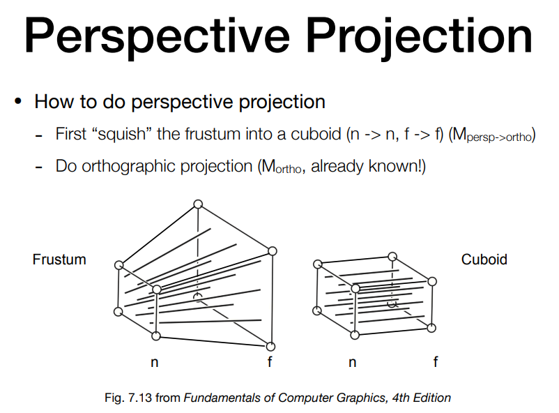
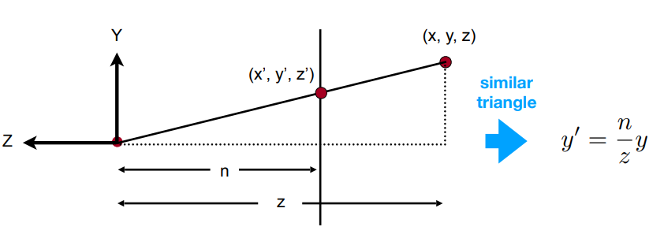
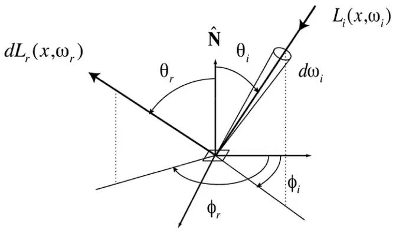
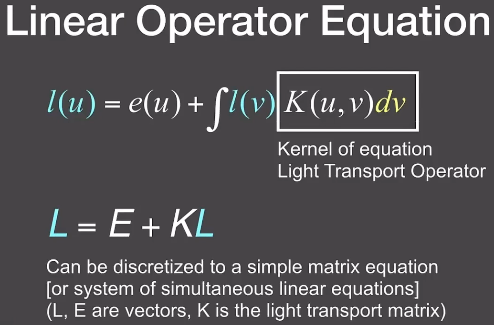
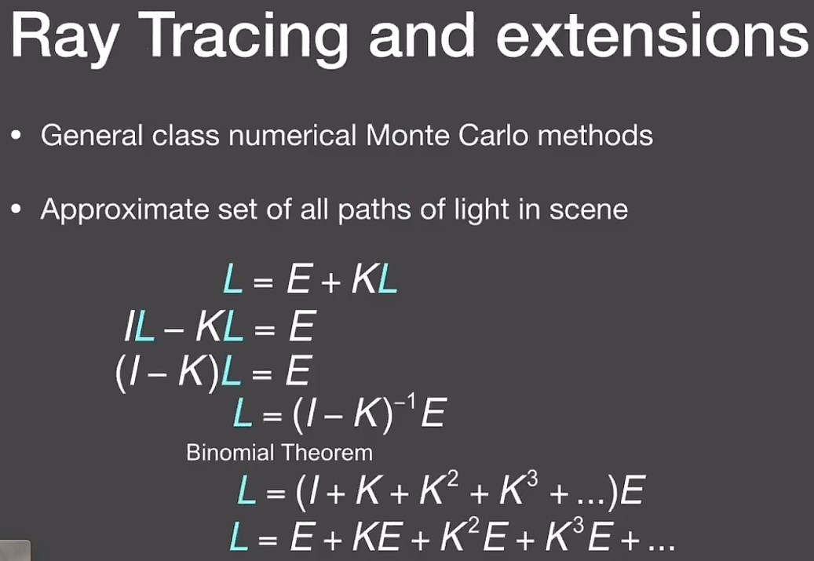
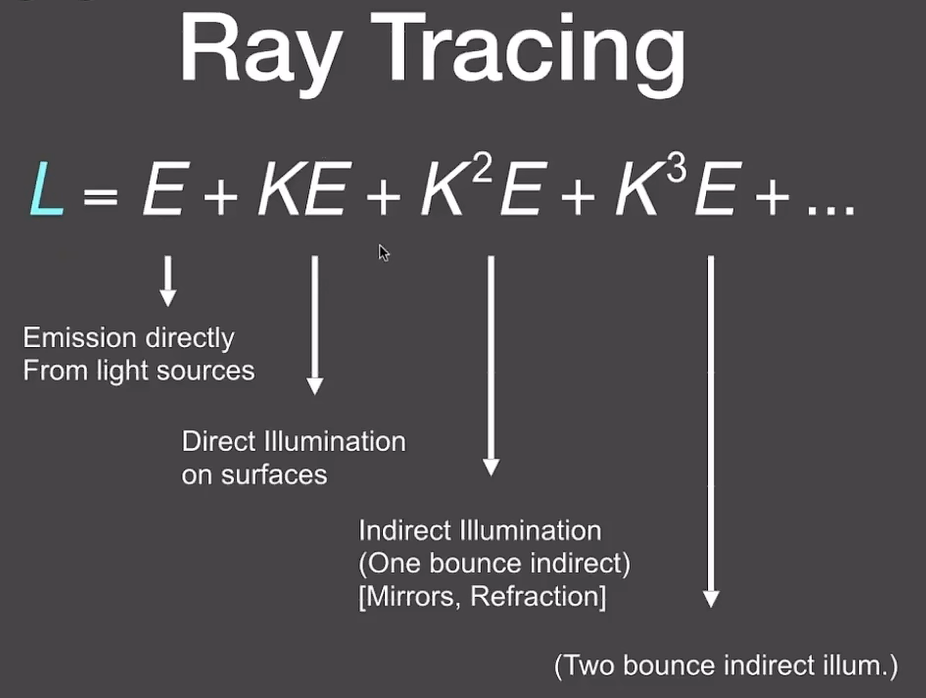

# GAMES101 笔记

## 课程注解

### 旋转变换矩阵是正交矩阵

### 先线性变换再平移

$$
\begin{pmatrix}
a&b&c&t_x\\
d&e&f&t_y\\
g&h&i&t_z\\
0&0&0&1\\
\end{pmatrix}=
\begin{pmatrix}
1&0&0&t_x\\
0&1&0&t_y\\
0&0&1&t_z\\
0&0&0&1\\
\end{pmatrix}\begin{pmatrix}
a&b&c&0\\
d&e&f&0\\
g&h&i&0\\
0&0&0&1\\
\end{pmatrix}
$$

$$
变换=平移变换\times线性变换
$$

### 透视投影

对远端平面上的任意一点，x、y坐标的缩放如下图所示

n为原点与近端平面的距离

因此变换后的齐次坐标为

$$
\begin{pmatrix}
nx/z\\ny/z\\z'\\1
\end{pmatrix}==\begin{pmatrix}
nx\\ny\\zz'\\z
\end{pmatrix}
$$

设变换矩阵的为

$$
\begin{pmatrix}
n&0&0&0\\
0&n&0&0\\
A&B&C&D\\
0&0&1&0\\
\end{pmatrix}
$$

近端平面上任意一点的坐标不变（规定）为n

$$
\begin{pmatrix}
x\\y\\n\\1
\end{pmatrix}==\begin{pmatrix}
nx\\ny\\n^2\\n
\end{pmatrix}
$$

因此

$$
\begin{pmatrix}
A&B&C&D
\end{pmatrix}\begin{pmatrix}
x\\y\\n\\1
\end{pmatrix}=Ax+By+Cn+D=n^2\\
=>A=B=0
$$

远端平面上任意一点的z坐标不变（规定）为f

$$
\begin{pmatrix}
0&0&C&D
\end{pmatrix}\begin{pmatrix}
x\\y\\f\\1
\end{pmatrix}=Cf+D=f^2
$$

联立解得

$$
C=n+f\\
D=-nf
$$

因此透视投影的变换矩阵为

$$
\begin{pmatrix}
n&0&0&0\\
0&n&0&0\\
0&0&n+f&-nf\\
0&0&1&0\\
\end{pmatrix}
$$

对梯形中的任意一点，变换之后的坐标为

$$
\begin{pmatrix}
n&0&0&0\\
0&n&0&0\\
0&0&n+f&-nf\\
0&0&1&0\\
\end{pmatrix}\begin{pmatrix}
x\\y\\z\\1
\end{pmatrix}=\begin{pmatrix}
nx\\ny\\(n+f)z-nf\\z
\end{pmatrix}\\
其中\ f\le z\le n\lt0
$$

计算可知

$$
\frac{(n+f)z-nf}{z}\le z
$$

因此变换之后，梯形体内部的z坐标相比变换前变小了，也即变远了

### 时域上的卷积等于频域上的乘积

傅里叶变换的性质

$$
F[f_1(t)]=F_1(x)\\
F[f_2(t)]=F_2(x)\\
F[f_1*f_2]=F_1\times F_2
$$

### 三维空间中三角形内点的重心坐标，在投影到二维平面上后发生改变

因此对像素做插值时，应该先将像素中心坐标变换回原三角形中的坐标，再求其重心坐标并插值

### 双向反射分布函数（BRDF）

对任意入射光线，在任意反射方向下的反射能量的分布，定义材质的反射性质

$$
f_r(\omega_i\rightarrow\omega_r)=\frac{dL_r(\omega_r)}{dE_i(\omega_i)}=\frac{dL_r(\omega_r)}{L_i(\omega_i)\cos{\theta_i}d\omega_i}
$$

### 反射方程

对所有入射方向做积分（也即对所有入射光线求和）

$$
L_r(p,\omega_r)=\int_{H^2}f_r(p,\omega_i\rightarrow\omega_r)L_i(p,\omega_i)\cos{\theta_i}d\omega_i\\
=\int_{H^2}f_r(p,\omega_i\rightarrow\omega_r)E_i(p,\omega_i)
$$

递归则描述光线多次反射的过程

### 渲染方程

在反射方程中加入自发光项

$$
L_o(p,\omega_o)=L_e(p,\omega_o)+\int_{\Omega^+}L_i(p,\omega_i)f_r(p,\omega_i,\omega_o)(n\cdot\omega_i)d\omega_i
$$

由于光线可以在物体表面间弹射，为了求解全局光照，将渲染方程记作如图形式

对入射光线求反射的过程可以简写为一个算符

即得全局光照方程，其中各项的物理意义即为：光源项、表面反射项、弹射一次的表面反射项、弹射两次的表面反射项等

其中除前两项（直接光照）外，（间接光照）更适合用光线追踪方法完成
